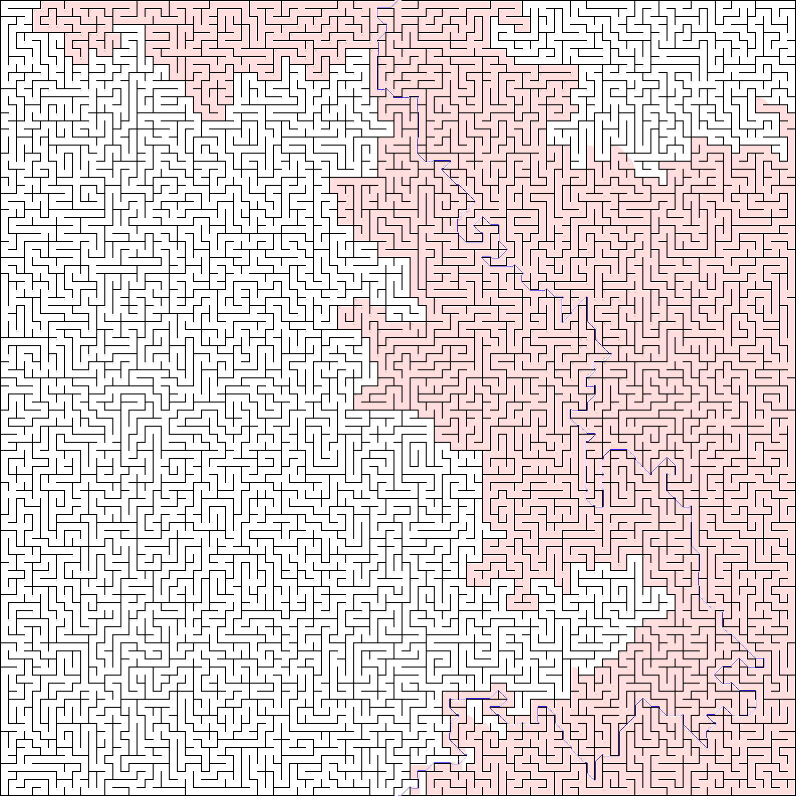

# A* for 2D grids

This is an implementation of the A* path planning algorithm, specifically tailored for
2D rectangular grids.

It is inspired by other two open source implementations:

- [hjweide/a-star](https://github.com/hjweide/a-star)
- [daancode/a-star](https://github.com/daancode/a-star)

Nevertheless, this implementation is 20% faster than the former and few orders of magnitude (3+)
faster than the latter.

You might also want to take a look to [astar-algorithm-cpp](https://github.com/justinhj/astar-algorithm-cpp),
but this implementation is more generic and it is not specifically optimized for 2D gridmaps.

To achieve this speed, the library uses a fairly large amount of RAM to perform many
operations in __O(1)__. The number of memory allocations is reduced to the very minimum.

It requires __at least__ 10 bytes for each cell in the grid, in other words,
more than 10 Mb of memory for a 1000x1000 gridmap.

## Usage 

You must pass the image using the method __setWorldData()__.

Note that the the image data must be row-major and monochromatic.

A value of 0 (black) represents an obstacle, whilst 255 (white)
is a free cell.

```c++

    // You don't need to use this image parser, you can use your own.   
    Image image;
    image.readFromPGM("./data/maze_big.pgm");

    AStar::PathFinder generator;

    generator.setWorldData( image.width(),
                            image.height(),
                            image.data() );
                
    AStar::Coord2D startPos (image.width()/2, 0);
    AStar::Coord2D targetPos(image.width()/2, image.height()/2 -1);
               
    auto path = generator.findPath(startPos, targetPos);

```

In the following example, the algorithm required about 200 milliseconds and 25 Mb
of RAM to find the solution in a 1586x1586 maze.

The pink pixels represent the cells of the grid visited by the algorithm.




# License

Copyright 2018 Eurecat

Licensed under the Apache License, Version 2.0 (the "License"); you may not use this file 
except in compliance with the License. You may obtain a copy of the License at

[http://www.apache.org/licenses/LICENSE-2.0](http://www.apache.org/licenses/LICENSE-2.0)

Unless required by applicable law or agreed to in writing, software distributed under the 
License is distributed on an "AS IS" BASIS, WITHOUT WARRANTIES OR CONDITIONS OF ANY KIND, 
either express or implied. See the License for the specific language governing permissions
 and limitations under the License.
 
 # References
 
 [Introduction to A*](https://www.redblobgames.com/pathfinding/a-star/introduction.html)

